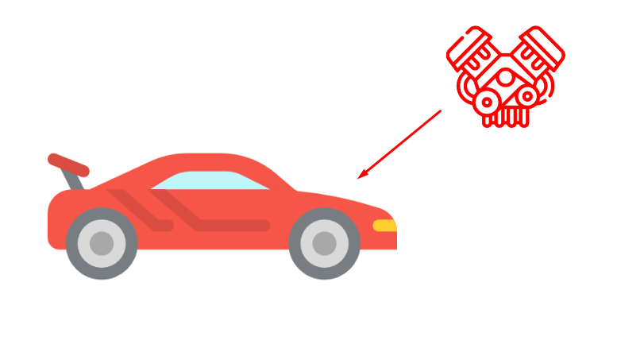

# Compostion, Aggregation, Static Method and Factory Method

## 1. Compostion
Relationship/hubungan dalam OOP, TAPI BERBEDA DENGAN INHARITANCE

Composition adalah sebuah hubungan antar Class yang mana sebuah Class merupakan bagian dari Class lain, dan saling tergantung satu sama lain.

Sub object akan hancur/destroy jika object utamanya juga hancur.

Contoh: dalam kasus mobil menyala, mobil itu akan menyala jika ada mesin, kalau diambil mesinnya mesin maka mobil tidak akan menyala.


Code:
```js
class Engine {
    constructor(capacity, type) {
        this.type = type
        this.capacity = capacity
    }
}

class Vehicle {
    constructor(brand, engineCapacity, engineType) {
        this.brand = brand
        this.engine = new Engine(engineCapacity, engineType)
    }
}

let honda = new Vehicle("Honda", "3000cc", "Hybrid")

console.log(honda);
```

## 2. Aggregation
Aggregation adalah Hubungan antara dua Kelas dimana kelas bagian atau sub-class bisa eksis tanpa harus bergantung pada Kelas utama.

contoh: dalam kasus mobil dan pengemudi, mobil akan tetap menyala walaupun ditinggalkan oleh pengemudinya, selama mesinnya gak dimatiin.


Code:
```js
class Driver {
    constructor(name) {
        this.name = name
    }
}

class Vehicle {
    constructor(brand, color) {
        this.brand = brand
        this.color = color
    }

    addDriver(driver) {
        this.Driver = driver
    }
}

let honda = new Vehicle("Honda", "Black")
let juned = new Driver("Juned")

honda.addDriver(juned)

console.log(honda);
```

## 3. Static Method
Static class methods are defined on the class itself.

You cannot call a static method on an object, only on an object class.

```js
class Car {
  constructor(name) {
    this.name = name;
  }
  static hello() {
    return "Hello!!";
  }
}

let myCar = new Car("Ford");

console.log(myCar.hello())

console.log(Car.hello())
```

## 4. Factory Method

Membungkus pembuatan object dalam satu tempat.

```js
class Car {
    constructor(brand, name, color, from) {
        this.brand = brand
        this.name = name
        this.color = color
        this.from = from
    }
}

class Honda extends Car {
    constructor(name, color) {
        super("Honda", name, color, "Japan")
    }
}

class Hyundai extends Car {
    constructor(name, color) {
        super("Hyundai", name, color, "Korea Selatan")
    }
}

class BMW extends Car {
    constructor(name, color) {
        super("BMW", name, color, "Jerman")
    }
}

class FactoryCar {
    static createCar(brand, name, color) {
        if(brand === "Honda") {
            return new Honda(name, color)
        } else if (brand === "Hyundai") {
            return new Hyundai(name, color)
        } else if (brand === "BMW") {
            return new BMW(name, color)
        } 
    }

    static createCars(data) {
        let result = []

        for (let i = 0; i < data.length; i++) {
            if(data[i].brand === "Honda") {
                result.push(new Honda(data[i].brand, data[i].name, data[i].color))
            } else if (data[i].brand === "Hyundai") {
                result.push(new Hyundai(data[i].brand, data[i].name, data[i].color))
            } else if (data[i].brand === "BMW") {
                result.push(new BMW(data[i].brand, data[i].name, data[i].color))
            } 
        }

        return result
    }
}

let cars = [
    {
        brand: "Honda",
        name: "Civic",
        blue: "blue"
    },
    {
        brand: "Hyundai",
        name: "Veloster Turbo",
        blue: "White"
    },
    {
        brand: "Honda",
        name: "NSX-R",
        blue: "White"
    },
    {
        brand: "MBW",
        name: "M3",
        blue: "White"
    },
]

let carsInstance = FactoryCar.createCars(cars)

console.log(cars);
console.log(carsInstance);
```

# Reference:
- https://www.youtube.com/watch?v=4l3bTDlT6ZI&list=PL4cUxeGkcC9i5yvDkJgt60vNVWffpblB7&index=1&ab_channel=TheNetNinja
- https://developer.mozilla.org/en-US/docs/Web/JavaScript/Reference/Classes/
- https://refactoring.guru/design-patterns/factory-method