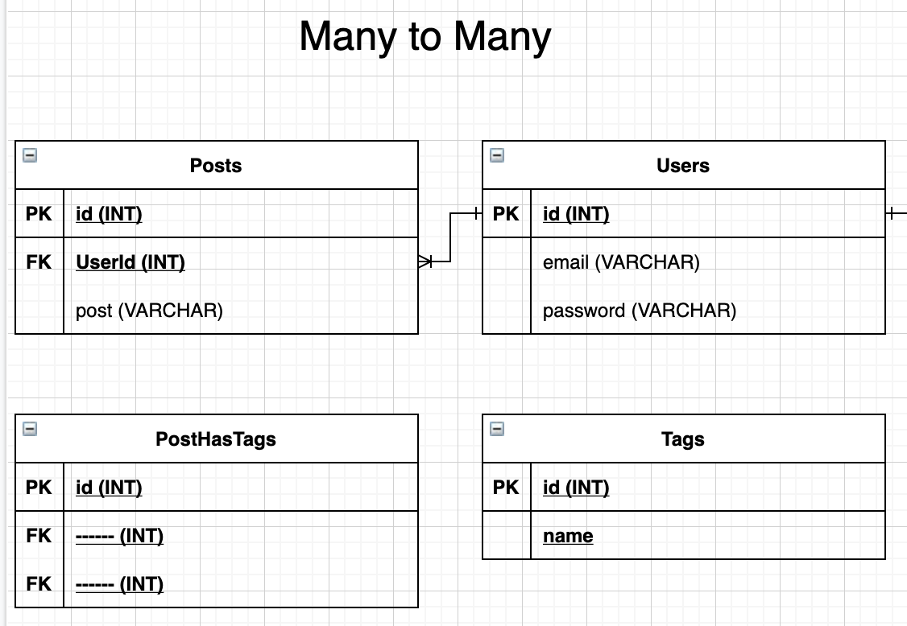
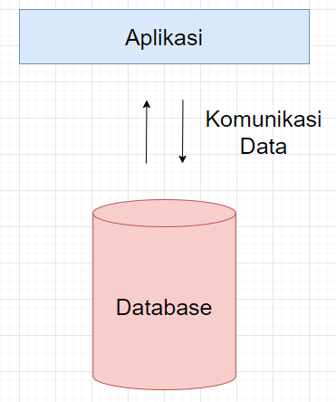

# Associations Many to Many

**Record**

## 1. [Recall](https://sequelize.org/v5/manual/associations.html)
Relasi itu ada 3 yaitu :
- One To One
- One To Many
- Many To Many

[Referensi jenis relasi](https://database.guide/the-3-types-of-relationships-in-database-design/) :

Secara syntax-nya associations di sequelize ada 4 yang bisa dipakai yang memiliki karakteristiknya masing-masing:
1. BelongsTo, **ditempatkan di model yang merupakan source model atau tempat foreign key berada.**
2. HasOne, **ditempatkan di model yang merupakan target model atau tempat referensi dari foreign key.**
3. HasMany, **hasMany juga ditempatkan di model yang merupakan target model atau tempat referensi dari foreign key.**
4. BelongsToMany, nanti di bahas.

Kata kunci:
1. `DALAM RELASI ONE TO ONE, FOREIGN KEY BISA DILETAKAN DIMANA SAJA`
2. `DALAM RELASI ONE TO MANY, FOREIGN KEY DILETAKAN DI TABLE MANY`
3. `DALAM RELASI MANY TO MANY, FOREIGN KEY DILETAKAN DI TABLE BARU`

## 2. [Create New Model and Migration](https://sequelize.org/master/manual/migrations.html#migration-skeleton)

Membuat relasi many to many, jika kita menemukan pola seperti ini maka perlu membuat table junction.



Jika relasinya adalah **Many To Many** maka **forign key-nya di letakan di table juction**, contohnya adalah jika kita punya 2 table yaitu Posts dan Tags, maka jika kita ingin membuat post memiliki tag, dimana 1 post bisa memiliki banyak tag dan 1 tag bisa pakai oleh banyak post disini terlihat pola many to many. maka kita perlu membuat table junction, misal namanya adalah table PostHasTags yang didalamnya ada TagId dan PostId.

Dengan command: 

```npx sequelize-cli model:generate --name Tag --attributes name:string```

```npx sequelize-cli model:generate --name PostHasTag --attributes PostId:integer,TagId:integer```


```js
// codingan migration yang lain
/**
Dibawah ini adalah salah satu cara untuk membuat fk
*/
TagId: {
  type: Sequelize.INTEGER,
  references:{
    model:{
      tableName: "Tags"
    },
    key: "id"
  },
  onDelete: "CASCADE",
  onUpdate: "CASCADE"
},

// codingan migration yang lain
```

karena disini kita tagnya belum ada datanya, boleh dibuat seed atau isi langsung di database.

## 4. [Model Many To Many](https://sequelize.org/v5/manual/associations.html#belongs-to-many-associations)
Relasi many to many, membutuhkan table tambahan yang bisa disebut table junction atau pivot. Jika bingung menentukan nama table junction maka buatlah penamaan seperti ini, ProductHasTags atau TagHasProducts. 

```js
// potongan code model

static associate(models) {
  Post.belongsToMany(models.Tag, { through: 'PostHasTag', foreignKey: "PostId" });
}

```

```js
// potongan code model

static associate(models) {
  Tag.belongsToMany(models.Post, { through: 'PostHasTag', foreignKey: "TagId" });
}

```

## 5. [Show data relation (join)](https://sequelize.org/v5/manual/querying.html#relations---associations)
```js
Post
  .findAll({
      include: [
          { 
              model: Tag
          }
      ]
  })
  .then(data => {
      // do something
  })
  .catch(error => {
      // do something
  })
```

## 6. [Relasi di migration dan model itu BERBEDA](https://sequelize.org/v5/manual/associations.html)

Relasi yang ada di migration dan model itu `BERBEDA ALAM`. Relasi yang ada di migration ada di dalam `databasenya` sedangkan relasi yang ada di model itu ada di `aplikasinya`.




# Referensi 
- https://sequelize.org/v5/manual/associations.html
- https://sequelize.org/v5/manual/associations.html#one-to-one-associations
- https://sequelize.org/v5/manual/associations.html#one-to-many-associations--hasmany-
- https://medium.com/@andrewoons/how-to-define-sequelize-associations-using-migrations-de4333bf75a7
- https://medium.com/@MomchilKolev/sequelize-migrations-with-relations-a8fd40a0912b
- https://sequelize.org/master/class/lib/model.js~Model.html#static-method-belongsToMany
