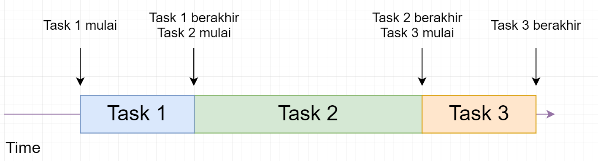
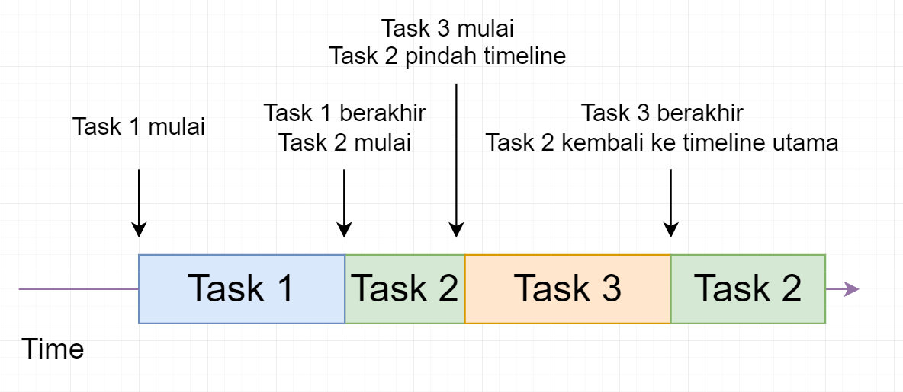

# Callback

## 1. Asynchronous
Javascript itu bisa sync dan async. Bedanya?
Sync itu task 2 menunggu task 1 selesai.
Async itu task 2 tidak menunggu task 1 selesai.

contoh kita punya 3 task
- Task 1, tampilkan mulai
- Task 2, baca data dan tampilkan selesai baca data
- Task 3, tampilkan task 3 aja
 
Jika sync maka mengerjakan task 1 sampai 3, seperti biasa

```js
// case 1
console.log("task 1 <<<<<<");
console.log("task 2 <<<<<<");
console.log("task 3 <<<<<<");


// case 2
console.log("mulai")

console.log("baca data mulai", "<<<<<<");
let data = fs.readFileSync("./kota.json", "utf8")
console.log("baca data selesai", "<<<<<<");

console.log("task 3 aja")

```

Jika async kita mengerjakan task 1

terus setelahnya kita ke task 2 karena task 2 itu membaca data(membaca data biasanya lebih lama dibanding eksekusi perintah tampilkan) maka kita buat task 2 itu menggunakan mekanisme async

maka task 2 ini akan dibawa ke tempat lain(timeline alternatif), dan akan lansung mengeksekusi task 3, ketika nantinya task 2 selesai, maka task 2 akan dikembalikan ke timeline utama.

```js
// case 1
// -----------------------------------------
console.log("task 1 <<<<<<");
setTimeout(() => {
    console.log("task 2 <<<<<<");
}, 5000)
console.log("task 3 <<<<<<");
// -----------------------------------------


// case 2
// -----------------------------------------
console.log("mulai")

console.log("baca data mulai", "<<<<<<");
fs.readFile("./kota.json", "utf8", (err, data) => {
    console.log("baca data selesai", "<<<<<<")
})

console.log("task 3 aja")
// -----------------------------------------
```

## 2. Callback
```js
// normal
// -----------------------------------------
function sum(num1, num2, language) {
    console.log(`num1: ${num1}`)
    console.log(`num2: ${num2}`)

    let resultSum = num1 + num2

    if(language === "english") {
        display(resultSum)
    } else if(language === "indonesia") {
        tampilkan(resultSum)
    }
}

function display(value) {
    console.log(`result: ${value}`);
}

function tampilkan(value) {
    console.log(`hasilnya: ${value}`);
}

sum(5, 10, "indonesia");
// -----------------------------------------


// with callback
// -----------------------------------------
function sum(num1, num2, callback) {
    console.log(`num1: ${num1}`);
    console.log(`num2: ${num2}`);
    
    let resultSum = num1 + num2 

    callback(resultSum)
}

function display(value) {
    console.log(`result: ${value}`);
}

function tampilkan(value) {
    console.log(`hasilnya: ${value}`);
}

sum(5, 10, tampilkan);

sum(5, 10, function(value) {
    console.log(`result: ${value}`);
});

sum(5, 10, function(value) {
    console.log(`hasilnya: ${value}`);
});

sum(5, 10, function(value) {
    console.log(`hasilnya: ${value}`);

    sum(2, 2, function(value) {
        console.log(`result: ${value}`);
    })
});
// -----------------------------------------
```

A callback is a function passed as an argument to another function and then function can run after another function has finished

Callback itu bisa sync dan bisa juga async, contoh:

Sync:

contoh function callback built in javascript. forEach, map, filter, find, dll 

Async: 

contohnya function yang diawal tadi baca kota

# Reference:
- https://www.youtube.com/watch?v=wVtdv5BHhno
- https://www.youtube.com/watch?v=5bOBknsIGQI
- https://developer.mozilla.org/en-US/docs/Learn/JavaScript/Asynchronous/Concepts
- https://www.w3schools.com/js/js_callback.asp
- https://www.w3schools.com/js/js_asynchronous.asp